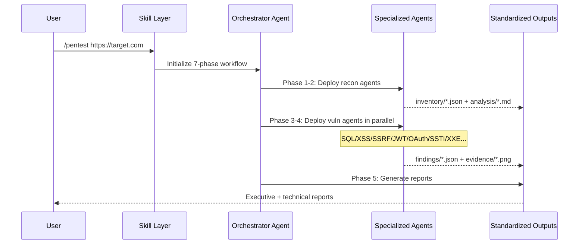

# Transilience AI Community Security Tools

<div align="center">

[](https://www.transilience.ai)
[](https://choosealicense.com/licenses/mit/)
[](https://github.com/transilienceai/communitytools/stargazers)
[](https://claude.ai)

**Open-source Claude Code skills and agents for AI-powered penetration testing, bug bounty hunting, AI threat testing, and security reconnaissance — from the team at [Transilience.ai](https://www.transilience.ai)**

[Quick Start](#-quick-start) | [Skills & Agents](#-skills--agents) | [Architecture](#-architecture) | [Contributing](CONTRIBUTING.md) | [Website](https://www.transilience.ai)

</div>

---

## Announcement

**Practice Makes Perfect: Teaching an AI to Hack by Learning from Its Mistakes** (March 2026)

We built an autonomous pentesting agent that scores **100% (104/104)** on a published CTF benchmark suite — using only structured markdown skill files, no fine-tuning. Starting from a bare 89.4% baseline, we ran a simple loop roughly 15 times: run the benchmarks, find a failure, diagnose the missing technique, write it into a skill file, and run again. The same skills transfer cross-model: Claude Sonnet 4.6 reaches 96.2% and Claude Haiku 4.5 reaches 62.5%. This repository contains the full skill set described in the paper.

**[Read the paper](https://www.transilience.ai/research/practice-makes-perfect)** · **[PDF](papers/practice-makes-perfect.pdf)**

---

## Overview

**Transilience AI Community Tools** is a consolidated Claude Code security testing suite — **23 skills**, **8 agents**, and **2 tool integrations** that cover the full penetration testing lifecycle from reconnaissance to reporting.

### Why Choose Transilience Community Tools?

- **AI-Powered Automation** — Claude orchestrates intelligent security testing workflows
- **Complete OWASP Coverage** — 100% OWASP Top 10 + OWASP LLM Top 10
- **Professional Reporting** — CVSS 3.1, CWE, MITRE ATT&CK, Transilience-branded PDF reports
- **Playwright Integration** — Browser automation for client-side vulnerability testing
- **Payload-Enriched References** — 160+ reference files with inline PayloadsAllTheThings techniques
- **Open Source** — MIT licensed for commercial and personal use

---

## Quick Start

### 1. Clone and enter the project

```bash
git clone https://github.com/transilienceai/communitytools.git
cd communitytools/projects/pentest
```

### 2. Install tools (optional but recommended)

```bash
# Browser automation (XSS, CSRF, clickjacking testing)
.claude/tools/playwright/install.sh

# CLI tools (nmap, sqlmap, nikto, gobuster, ffuf, testssl)
.claude/tools/kali/install.sh

# Verify
.claude/tools/check-all.sh
```

### 3. Open Claude Code and run skills

```bash
claude    # Launch Claude Code from the projects/pentest directory
```

Then use slash commands inside the Claude session:

```
/coordination https://target.com     # Full penetration test
/hackthebox                          # HackTheBox challenge automation
/hackerone                           # Bug bounty workflow
/techstack-identification            # Passive tech stack recon
/reconnaissance target.com           # Attack surface mapping
/source-code-scanning ./app          # Static code analysis
```

---

## Skills & Agents

All skills and agents live under `projects/pentest/.claude/`.

### Agents (8)

| Agent | Role |
|-------|------|
| **Pentester Orchestrator** | Coordinates pentests — plans, dispatches parallel agent batches, analyzes results, adapts |
| **Pentester Executor** | Thin experiment runner — executes specific tests, returns raw results |
| **Pentester Validator** | Validates findings against raw evidence — all 5 checks must pass or finding is rejected |
| **HackTheBox** | Platform automation — login, challenge selection, VPN, delegates solving, logs proceedings |
| **HackerOne Hunter** | Bug bounty automation — scope parsing, parallel testing, PoC validation, submission reports |
| **Script Generator** | Generates optimized scripts for pentest agents — parallelization, syntax validation |
| **PATT Fetcher** | On-demand PayloadsAllTheThings retrieval when local payloads are insufficient |
| **Skiller** | Skill creation and management — scaffolding, validation, GitHub workflow |

### Skills by Category (23)

#### Vulnerability Testing (10)

| Skill | Coverage |
|-------|----------|
| `/injection` | SQL, NoSQL, OS Command, SSTI, XXE, LDAP/XPath |
| `/client-side` | XSS (Reflected/Stored/DOM), CSRF, Clickjacking, CORS, Prototype Pollution |
| `/server-side` | SSRF, HTTP Smuggling, Path Traversal, File Upload, Deserialization, Host Header |
| `/authentication` | Auth Bypass, JWT, OAuth, Password Attacks, 2FA Bypass, CAPTCHA Bypass |
| `/api-security` | GraphQL, REST API, WebSockets, Web LLM |
| `/web-app-logic` | Business Logic, Race Conditions, Access Control, Cache Poisoning/Deception, IDOR |
| `/cloud-containers` | AWS, Azure, GCP, Docker, Kubernetes |
| `/system` | Active Directory, Privilege Escalation (Linux/Windows), Exploit Development |
| `/infrastructure` | Port Scanning, DNS, MITM, VLAN Hopping, IPv6, SMB/NetBIOS |
| `/social-engineering` | Phishing, Pretexting, Vishing, Physical Security |

#### Reconnaissance (3)

| Skill | Purpose |
|-------|---------|
| `/reconnaissance` | Subdomain discovery, port scanning, endpoint enumeration, API discovery, attack surface mapping |
| `/osint` | Repository enumeration, secret scanning, git history analysis, employee footprint |
| `/techstack-identification` | Passive tech stack inference across 17 intelligence domains |

#### Specialized (3)

| Skill | Purpose |
|-------|---------|
| `/ai-threat-testing` | OWASP LLM Top 10 — prompt injection, model extraction, data poisoning, supply chain |
| `/cve-poc-generator` | CVE research, NVD lookup, safe Python PoC generation, vulnerability reports |
| `/source-code-scanning` | SAST — OWASP Top 10, CWE Top 25, dependency CVEs, hardcoded secrets |

#### Platform Integrations (2)

| Skill | Purpose |
|-------|---------|
| `/hackerone` | Scope CSV parsing, parallel asset testing, PoC validation, platform-ready submissions |
| `/hackthebox` | Playwright-based login, challenge browsing, VPN management, automated solving |

#### Orchestration & Tooling (5)

| Skill | Purpose |
|-------|---------|
| `/coordination` | Engagement orchestration, test planning, output structure |
| `/essential-tools` | Burp Suite, Playwright automation, methodology, reporting standards |
| `/transilience-report-style` | Transilience-branded PDF report generation (ReportLab) |
| `/github-workflow` | Git branching, commits, PRs, issues, code review |
| `/skiller` | Skill scaffolding, validation, GitHub workflow automation |

### Tool Integrations (2)

| Tool | Purpose |
|------|---------|
| **Playwright** | Browser automation for client-side testing via MCP |
| **Kali Linux Tools** | nmap, masscan, nikto, gobuster, ffuf, sqlmap, testssl, and more |

---

## Architecture

The suite uses a hybrid **AGENTS.md + Skills** architecture based on [Vercel research](https://vercel.com/blog/agents-md-outperforms-skills-in-our-agent-evals) showing 100% pass rate vs 53-79% for skills alone:

- **AGENTS.md** (root) — Passive knowledge base, always loaded. Compressed security payloads, methodologies (PTES, OWASP, MITRE), CVSS scoring, PoC standards.
- **Skills** (`.claude/skills/`) — User-triggered workflows invoked with `/skill-name`. Multi-step orchestration, parallel agents, checkpointing.
- **Agents** (`.claude/agents/`) — Autonomous workers spawned by skills and orchestrators.

### Multi-Agent Execution Flow


```mermaid
sequenceDiagram
    participant User
    participant Skill as Skill Layer
    participant Orch as Orchestrator Agent
    participant Agents as Specialized Agents
    participant Output as Standardized Outputs

    User->>Skill: /pentest https://target.com
    Skill->>Orch: Initialize 7-phase workflow

    Orch->>Agents: Phase 1-2: Deploy recon agents
    Agents-->>Output: inventory/*.json + analysis/*.md

    Orch->>Agents: Phase 3-4: Deploy vuln agents in parallel
    Note over Agents: SQL/XSS/SSRF/JWT/OAuth/SSTI/XXE...
    Agents-->>Output: findings/*.json + evidence/*.png

    Orch->>Output: Phase 5: Generate reports
    Output-->>User: Executive + technical reports
```

### Repository Structure

```
communitytools/
├── AGENTS.md                    # Passive security knowledge (always loaded)
├── CLAUDE.md                    # Project instructions
├── marketplace.json             # Machine-readable project manifest
├── papers/                      # Research papers
├── benchmarks/                  # XBOW benchmark runner
└── projects/pentest/            # Main project
    └── .claude/
        ├── agents/              # 8 agent definitions
        │   ├── pentester-orchestrator.md
        │   ├── pentester-executor.md
        │   ├── pentester-validator.md
        │   ├── hackthebox.md
        │   ├── hackerone.md
        │   ├── script-generator.md
        │   ├── patt-fetcher.md
        │   ├── skiller.md
        │   └── reference/       # Output structure, test plan format
        ├── skills/              # 23 skill directories
        │   ├── {skill-name}/
        │   │   ├── SKILL.md     # Skill definition
        │   │   └── reference/   # Attack techniques, cheat sheets, payloads
        │   └── ...
        └── tools/               # Tool integrations
            ├── playwright/
            └── kali/
```

---

## Contributing

We welcome contributions from the security community!

**Read the full guide:** [CONTRIBUTING.md](CONTRIBUTING.md)

**Quick path using the Skiller:**
```bash
/skiller
# Select: CREATE → provide details → automated GitHub workflow
# Handles: issue creation, branch, skill generation, validation, commit, PR
```

---

## Security & Legal

**IMPORTANT: These tools are designed for authorized security testing ONLY.**

**Authorized & Legal Use:**
- Penetration testing with written authorization
- Bug bounty programs within scope
- Security research on your own systems
- CTF competitions and training environments
- Educational purposes with proper permissions

**Prohibited & Illegal Use:**
- Unauthorized testing of any systems
- Malicious exploitation of vulnerabilities
- Data theft or system disruption
- Any use that violates local or international laws

**Users are solely responsible for compliance with all applicable laws and regulations.**

### Responsible Disclosure

If you discover a vulnerability using these tools:
1. Do not exploit beyond proof-of-concept
2. Report immediately to the vendor/organization
3. Follow responsible disclosure timelines (typically 90 days)
4. Document thoroughly for remediation

---

## Community & Support

- [GitHub Discussions](https://github.com/transilienceai/communitytools/discussions) — Ask questions, share ideas
- [GitHub Issues](https://github.com/transilienceai/communitytools/issues) — Report bugs, request features
- [Transilience.ai](https://www.transilience.ai) — See what else we're building
- [LinkedIn](https://linkedin.com/company/transilienceai) — Follow our work
- [Email](mailto:contact@transilience.ai) — Get in touch

---

## Project Stats

| Category | Count |
|----------|-------|
| **Skills** | 23 |
| **Agents** | 8 |
| **Tool Integrations** | 2 |
| **Attack Types** | 53 |
| **Reference Files** | 160+ |

**Coverage:**
- OWASP Top 10 (2021) — 100%
- OWASP LLM Top 10 (2025) — 100%
- SANS Top 25 CWE — 90%+
- MITRE ATT&CK TTPs — mapped for all findings

---

## License

MIT License — Copyright (c) 2026 Transilience AI. See [LICENSE](LICENSE) for details.

---

## Contributors

<a href="https://github.com/transilienceai/communitytools/graphs/contributors">
  
</a>

---

<div align="center">

**Built by [Transilience AI](https://www.transilience.ai)**

We build AI-driven cloud security and compliance automation. These open-source tools reflect how we think about security — if you're curious about the platform behind them, [take a look](https://www.transilience.ai).

[](https://github.com/transilienceai/communitytools)

[Website](https://www.transilience.ai) | [Issues](https://github.com/transilienceai/communitytools/issues) | [Discussions](https://github.com/transilienceai/communitytools/discussions)

`claude-code` `ai-security` `penetration-testing` `bug-bounty` `owasp` `llm-security` `ai-threat-testing` `security-automation` `ethical-hacking` `cybersecurity` `appsec` `web-security` `hackerone` `hackthebox` `multi-agent`

</div>
