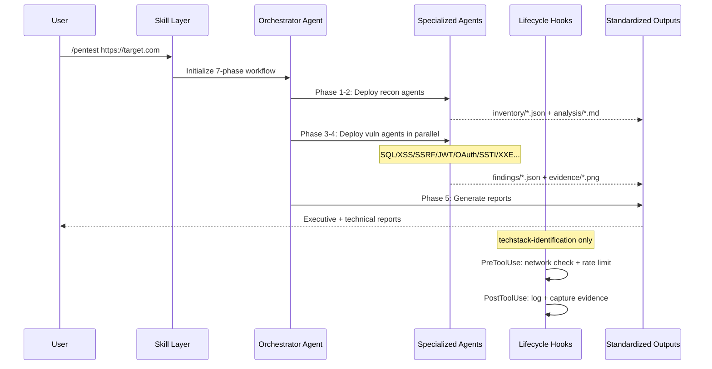
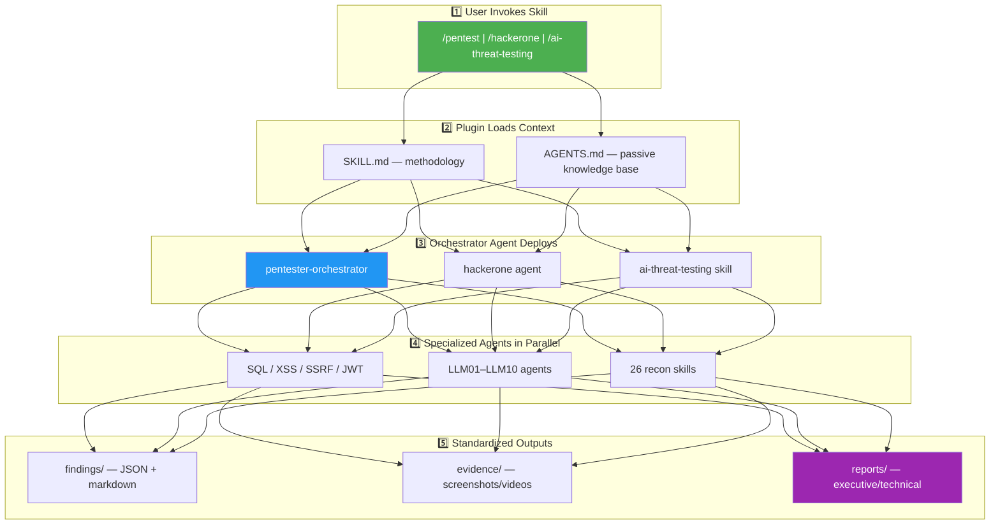

# Transilience AI Community Security Tools

<div align="center">

[](https://choosealicense.com/licenses/mit/)
[](CONTRIBUTING.md)
[](https://github.com/transilienceai/communitytools/issues)
[](https://github.com/transilienceai/communitytools/stargazers)
[](https://claude.ai)

**Open-source Claude Code plugins for AI-powered penetration testing, bug bounty hunting, AI threat testing, and security reconnaissance**

[🚀 Quick Start](#-quick-start) • [📦 Plugins](#-available-plugins) • [📖 Documentation](#-how-it-works) • [🤝 Contributing](CONTRIBUTING.md) • [🌐 Website](https://www.transilience.ai)

</div>

---

## 📋 Table of Contents

- [Overview](#-overview)
- [Available Plugins](#-available-plugins)
- [Architecture](#-architecture)
- [Quick Start](#-quick-start)
- [How It Works](#-how-it-works)
- [Contributing](#-contributing)
- [Security & Legal](#-security--legal)
- [Community](#-community)
- [Roadmap](#-roadmap)
- [License](#-license)

---

## 🎯 Overview

**Transilience AI Community Tools** is a **Claude Code plugin marketplace** providing AI-powered security workflows for penetration testing, bug bounty hunting, AI threat testing, and tech stack reconnaissance. Each tool is packaged as an independent plugin — install only what you need.

### What's Inside?

This repository hosts **5 independent Claude Code plugins**:

| Plugin | Skills | Agents | Hooks | Purpose |
|--------|--------|--------|-------|---------|
| `pentest` | 6 | 3 | — | Full penetration testing framework |
| `hackerone` | 1 | 1 | — | Bug bounty automation |
| `ai-threat-testing` | 1 | 10 | — | OWASP LLM Top 10 testing |
| `techstack-identification` | 26 | 5 | 3 | Tech stack reconnaissance |
| `skiller` | 1 | 1 | — | Skill creation meta-tool |

### Why Choose Transilience Community Tools?

- 🤖 **AI-Powered Automation** — Claude orchestrates intelligent security testing workflows
- 📦 **Modular Plugin Architecture** — Install only what you need, update independently
- 🔍 **Complete OWASP Coverage** — 100% OWASP Top 10 + OWASP LLM Top 10
- 📊 **Professional Reporting** — CVSS 3.1, CWE, MITRE ATT&CK, remediation guidance
- 🔬 **Playwright Integration** — Browser automation for client-side vulnerability testing
- 💣 **PATT Payload Database** — 50+ curated payload files from PayloadsAllTheThings
- 📚 **264+ Lab Walkthroughs** — PortSwigger Academy solutions
- ⚖️ **Open Source** — MIT licensed for commercial and personal use

---

## 📦 Available Plugins

### `pentest` — Comprehensive Penetration Testing

**6 skills • 3 agents • 46+ attack types • 264+ PortSwigger lab walkthroughs**

Orchestrates a complete 7-phase penetration test using specialized vulnerability agents.

**Skills included:**
- `/pentest` — Full 7-phase PTES methodology with 35+ parallel testing agents
- `/authenticating` — Auth testing, 2FA bypass, CAPTCHA, bot detection evasion
- `/common-appsec-patterns` — OWASP Top 10 quick-hit testing
- `/cve-testing` — CVE research, matching, and exploitation attempts
- `/domain-assessment` — Subdomain discovery, port scanning, attack surface mapping
- `/web-application-mapping` — Endpoint discovery, technology detection, app mapping

**Vulnerability coverage:**
- **Injection:** SQL, NoSQL, Command, SSTI, XXE, LDAP/XPath
- **Client-Side:** XSS (Reflected/Stored/DOM), CSRF, Clickjacking, CORS, Prototype Pollution
- **Server-Side:** SSRF, HTTP Smuggling, File Upload, Path Traversal, Deserialization
- **Authentication:** Auth Bypass, JWT, OAuth, Password Attacks, Session Fixation
- **API Security:** GraphQL, REST API, WebSockets, Web LLM
- **Business Logic:** Race Conditions, Access Control, Cache Poisoning/Deception, IDOR
- **Cloud/System:** AWS, Azure, GCP, Docker, Kubernetes, Active Directory

---

### `hackerone` — Bug Bounty Automation

**1 skill • 1 agent**

Automated bug bounty workflow from scope parsing to platform-ready submission.

**Skills included:**
- `/hackerone` — Parse scope, parallel testing, PoC validation, HackerOne/Bugcrowd-ready reports

---

### `ai-threat-testing` — AI Security Testing

**1 skill • 10 agents**

Full OWASP LLM Top 10 (2025) coverage with dedicated agents per vulnerability class.

**Skills included:**
- `/ai-threat-testing` — Orchestrates all 10 LLM vulnerability agents

**Agents (one per LLM risk):**
- LLM01: Prompt Injection
- LLM02: Insecure Output Handling
- LLM03: Training Data Poisoning
- LLM04: Resource Exhaustion
- LLM05: Supply Chain Vulnerabilities
- LLM06: Excessive Agency
- LLM07: Model Extraction
- LLM08: Vector & Embedding Poisoning
- LLM09: Overreliance
- LLM10: Logging & Monitoring Bypass

---

### `techstack-identification` — Tech Stack Reconnaissance

**26 skills • 5 agents • 3 lifecycle hooks**

Comprehensive reconnaissance suite for identifying technology stacks from passive signals.

**Skills included (26):**
DNS intelligence, subdomain enumeration, certificate transparency, HTTP fingerprinting, TLS analysis, CDN/WAF detection, cloud infrastructure detection, frontend/backend inference, JavaScript DOM analysis, HTML content analysis, API portal discovery, code repository intel, job posting analysis, IP attribution, web archive analysis, security posture analysis, signal correlation, third-party detection, devops detection, domain discovery, evidence formatting, confidence scoring, conflict resolution, JSON report generation, report exporter.

**Hooks (automatic lifecycle guards):**
- `PreToolUse` (Bash/WebSearch/WebFetch) — Network connectivity check
- `PreToolUse` (Bash/WebSearch/WebFetch) — Per-service rate limiting (crt.sh, GitHub API, DNS)
- `PostToolUse` (all) — Execution logging, evidence capture, metrics CSV

---

### `skiller` — Skill Creation Meta-Tool

**1 skill • 1 agent**

Automates the full contribution workflow for creating new Claude Code plugins.

**Skills included:**
- `/skiller` — Interactive: CREATE / UPDATE / REMOVE skills with automated GitHub workflow (issue → branch → skill generation → validation → commit → PR)

---

## 🏗️ Architecture

### Plugin Marketplace Structure

```
communitytools/
├── .claude-plugin/
│   ├── marketplace.json        # Indexes all 5 plugins
│   └── plugin.json             # Root plugin metadata
│
├── plugins/
│   ├── pentest/
│   │   ├── .claude-plugin/plugin.json
│   │   ├── agents/             # pentester-orchestrator, pentester-executor, patt-fetcher
│   │   └── skills/             # pentest, authenticating, common-appsec-patterns,
│   │                           #   cve-testing, domain-assessment, web-application-mapping
│   │
│   ├── hackerone/
│   │   ├── .claude-plugin/plugin.json
│   │   ├── agents/             # hackerone
│   │   └── skills/             # hackerone (with CSV/reporting tools)
│   │
│   ├── ai-threat-testing/
│   │   ├── .claude-plugin/plugin.json
│   │   ├── agents/             # llm01 through llm10
│   │   └── skills/             # ai-threat-testing
│   │
│   ├── techstack-identification/
│   │   ├── .claude-plugin/plugin.json
│   │   ├── agents/             # asset_discovery, correlation, data_collection,
│   │   │                       #   report_generation, tech_inference
│   │   ├── skills/             # 26 recon skills
│   │   └── hooks/
│   │       ├── hooks.json      # PreToolUse + PostToolUse lifecycle wiring
│   │       └── scripts/        # pre_network, pre_rate_limit, post_logging
│   │
│   └── skiller/
│       ├── .claude-plugin/plugin.json
│       ├── agents/             # skiller
│       └── skills/             # skiller
│
├── benchmarks/                 # AutoPenBench performance benchmarks
├── tools/                      # Kali and Playwright setup scripts
├── AGENTS.md                   # Passive security knowledge base (always loaded)
└── CLAUDE.md                   # Repository-wide Claude Code context
```

### Multi-Agent Execution Flow


```mermaid
sequenceDiagram
    participant User
    participant Skill as Skill Layer
    participant Orch as Orchestrator Agent
    participant Agents as Specialized Agents
    participant Hooks as Lifecycle Hooks
    participant Output as Standardized Outputs

    User->>Skill: /pentest https://target.com
    Skill->>Orch: Initialize 7-phase workflow

    Orch->>Agents: Phase 1-2: Deploy recon agents
    Agents-->>Output: inventory/*.json + analysis/*.md

    Orch->>Agents: Phase 3-4: Deploy vuln agents in parallel
    Note over Agents: SQL/XSS/SSRF/JWT/OAuth/SSTI/XXE...
    Agents-->>Output: findings/*.json + evidence/*.png

    Orch->>Output: Phase 5: Generate reports
    Output-->>User: Executive + technical reports

    Note over Hooks: techstack-identification only
    Hooks->>Hooks: PreToolUse: network check + rate limit
    Hooks->>Hooks: PostToolUse: log + capture evidence
```

---

## 🚀 Quick Start

### Prerequisites

- **Claude Code** ([Install](https://claude.ai/download))
- **Written Authorization** — Always get permission before testing any systems

### Installation

**Install the full marketplace (browse all plugins):**

```bash
/plugin marketplace add transilienceai/communitytools
```

**Install a specific plugin:**

```bash
/plugin install transilienceai/communitytools/pentest
/plugin install transilienceai/communitytools/hackerone
/plugin install transilienceai/communitytools/ai-threat-testing
/plugin install transilienceai/communitytools/techstack-identification
/plugin install transilienceai/communitytools/skiller
```

**Install scoped to current project only:**

```bash
/plugin install transilienceai/communitytools/pentest --scope project
```

**Alternative — clone the repository directly:**

```bash
git clone https://github.com/transilienceai/communitytools.git
cd communitytools
```

### Usage Examples

**Penetration Testing:**
```bash
/pentest
# Deploys 35+ specialized agents across all OWASP categories
```

**Bug Bounty:**
```bash
/hackerone
# Parse scope → parallel test → validate PoC → platform-ready report
```

**AI Security Testing:**
```bash
/ai-threat-testing
# Runs OWASP LLM Top 10 agents against your AI application
```

**Tech Stack Reconnaissance:**
```bash
/dns_intelligence         # DNS records and passive recon
/subdomain_enumeration    # Subdomain discovery
/cloud_infra_detector     # Identify cloud providers
/signal_correlator        # Aggregate all signals into tech profile
```

**Skill Development:**
```bash
/skiller
# CREATE → name → description → auto GitHub workflow
```

---

## 🔄 How It Works

### Three-Layer Architecture

Each plugin implements the same pattern:

1. **Skills Layer** (`plugins/<name>/skills/`) — User-facing workflows invoked via slash commands
2. **Agents Layer** (`plugins/<name>/agents/`) — Orchestrators and specialized testing agents
3. **Hooks Layer** (`plugins/<name>/hooks/`) — Automatic lifecycle guards (techstack plugin)


```mermaid
flowchart TB
    subgraph "1️⃣ User Invokes Skill"
        A["/pentest | /hackerone | /ai-threat-testing"]
    end

    subgraph "2️⃣ Plugin Loads Context"
        B1[SKILL.md — methodology]
        B2[AGENTS.md — passive knowledge base]
    end

    subgraph "3️⃣ Orchestrator Agent Deploys"
        C1[pentester-orchestrator]
        C2[hackerone agent]
        C3[ai-threat-testing skill]
    end

    subgraph "4️⃣ Specialized Agents in Parallel"
        D1[SQL / XSS / SSRF / JWT]
        D2[LLM01–LLM10 agents]
        D3[26 recon skills]
    end

    subgraph "5️⃣ Standardized Outputs"
        F1[findings/ — JSON + markdown]
        F2[evidence/ — screenshots/videos]
        F3[reports/ — executive/technical]
    end

    A --> B1 & B2
    B1 & B2 --> C1 & C2 & C3
    C1 & C2 & C3 --> D1 & D2 & D3
    D1 & D2 & D3 --> F1 & F2 & F3

    style A fill:#4CAF50,color:#fff
    style C1 fill:#2196F3,color:#fff
    style F3 fill:#9C27B0,color:#fff
```

### Standardized Output Formats

All skills follow `OUTPUT_STANDARDS.md`:

| Output Type | Directory Structure | Use Case |
|-------------|---------------------|----------|
| **Reconnaissance** | `inventory/` + `analysis/` | Domain assessment, web app mapping, techstack |
| **Vulnerability Testing** | `findings/` + `evidence/` + `reports/` | Pentest, CVE testing, AppSec patterns |
| **Bug Bounty** | Platform-ready submissions | HackerOne, Bugcrowd formatted |

**Key features:**
- CVSS 3.1 scoring
- CWE mapping
- OWASP Top 10 categorization
- MITRE ATT&CK TTPs
- Remediation guidance
- Evidence-based validation

---

## 🤝 Contributing

We welcome contributions from the security community!

### Contribution Workflow

**Automated (Recommended) — using `/skiller`:**

```bash
/skiller
# 1. Choose: CREATE, UPDATE, or REMOVE
# 2. Provide skill details
# 3. Select target plugin
# 4. Auto-generates: GitHub issue → branch → skill → validation → commit → PR
```

**Manual workflow:**

```bash
# 1. Create an issue first
gh issue create --title "Add skill: X" --body "Description..."

# 2. Create branch
git checkout -b feature/skill-name

# 3. Add your skill under the appropriate plugin:
#    plugins/<plugin-name>/skills/<your-skill>/SKILL.md

# 4. Commit with conventional format
git commit -m "feat(<plugin>): add <skill-name> skill - Fixes #<issue>"

# 5. Push and create PR
gh pr create --title "..." --body "Closes #<issue>"
```

**Read the full guide:** [CONTRIBUTING.md](CONTRIBUTING.md)

---

## ⚠️ Security & Legal

**⚠️ IMPORTANT: These tools are designed for authorized security testing ONLY.**

✅ **Authorized & Legal Use:**
- Penetration testing with written authorization
- Bug bounty programs within scope
- Security research on your own systems
- CTF competitions and training environments
- Educational purposes with proper permissions

❌ **Prohibited & Illegal Use:**
- Unauthorized testing of any systems
- Malicious exploitation of vulnerabilities
- Data theft or system disruption
- Any use that violates local or international laws

**Users are solely responsible for compliance with all applicable laws and regulations.**

### Responsible Disclosure

If you discover a vulnerability using these tools:
1. Do not exploit beyond proof-of-concept
2. Report immediately to the vendor/organization
3. Follow responsible disclosure timelines (typically 90 days)
4. Document thoroughly for remediation

---

## 🌐 About Transilience AI

[**Transilience AI**](https://www.transilience.ai) specializes in autonomous security testing and AI security operations.

---

## 📞 Community & Support

- 💬 **[GitHub Discussions](https://github.com/transilienceai/communitytools/discussions)** — Ask questions, share ideas
- 🐛 **[GitHub Issues](https://github.com/transilienceai/communitytools/issues)** — Report bugs, request features
- 🌐 **[Website](https://www.transilience.ai)** — Commercial products
- 📧 **[Email](mailto:contact@transilience.ai)** — Enterprise support

---

## 🗺️ Roadmap

### Current Status

**Released Plugins:**
- ✅ **pentest** — 6 skills, 3 agents, 46+ attack types, 264+ lab walkthroughs
- ✅ **hackerone** — Bug bounty automation from scope parsing to submission
- ✅ **ai-threat-testing** — OWASP LLM Top 10 with 10 dedicated agents
- ✅ **techstack-identification** — 26 skills, 5 agents, lifecycle hooks
- ✅ **skiller** — Skill creation meta-tool with full GitHub workflow

### Planned

**Q2 2026**
- [ ] **Cloud Security Plugin** — Full GCP coverage + orchestrated cloud misconfig skill
- [ ] **Container Security Plugin** — Docker and Kubernetes testing
- [ ] **Mobile Security Plugin** — iOS and Android app testing
- [ ] **Burp Suite Integration** — Export/import findings

**Q3 2026**
- [ ] **Compliance Reporting** — PCI-DSS, SOC 2, ISO 27001 report generation
- [ ] **Blockchain Security** — Smart contract auditing agents
- [ ] **IoT Security Plugin** — Firmware and embedded device testing

**Community Contributions Welcome:**
- New specialized vulnerability agents
- Additional lab walkthroughs
- Tool integrations (Metasploit, Nmap, etc.)
- Bug bounty platform integrations (Bugcrowd, Intigriti, YesWeHack)

---

## 📊 Project Stats

| Category | Count |
|----------|-------|
| **Plugins** | 5 |
| **Skills** | 35+ |
| **Agents** | 20+ |
| **Lifecycle Hooks** | 3 |
| **Lab Walkthroughs** | 264+ |
| **Attack Types** | 46+ |
| **PATT Payload Files** | 50+ |

**Coverage:**
- ✅ OWASP Top 10 (2021) — 100%
- ✅ OWASP LLM Top 10 (2025) — 100%
- ✅ SANS Top 25 CWE — 90%+
- ✅ MITRE ATT&CK TTPs — mapped for all findings

---

## 📝 License

MIT License — Copyright (c) 2025 Transilience AI. See [LICENSE](LICENSE) for details.

---

## 🏆 Contributors

<a href="https://github.com/transilienceai/communitytools/graphs/contributors">
  
</a>

---

<div align="center">

**Built with ❤️ by [Transilience AI](https://www.transilience.ai)**

[](https://github.com/transilienceai/communitytools)

[Website](https://www.transilience.ai) • [Issues](https://github.com/transilienceai/communitytools/issues) • [Discussions](https://github.com/transilienceai/communitytools/discussions)

`claude-code` `claude-plugins` `ai-security` `penetration-testing` `bug-bounty` `owasp` `llm-security` `ai-threat-testing` `techstack` `security-automation` `ethical-hacking` `cybersecurity` `appsec` `web-security` `hackerone` `portswigger` `multi-agent`

</div>
