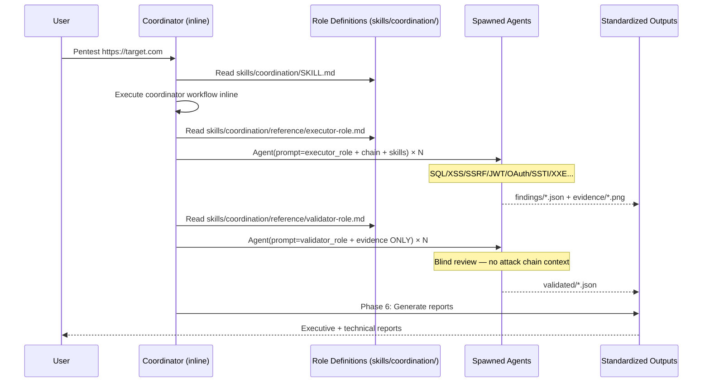

# Transilience AI Community Security Tools

<div align="center">

[](https://www.transilience.ai)
[](https://choosealicense.com/licenses/mit/)
[](https://github.com/transilienceai/communitytools/stargazers)
[](https://claude.ai)

**Open-source Claude Code skills and agents for AI-powered penetration testing, bug bounty hunting, AI threat testing, and security reconnaissance — from the team at [Transilience.ai](https://www.transilience.ai)**

[Quick Start](#-quick-start) | [Skills](#-skills) | [Architecture](#-architecture) | [Contributing](CONTRIBUTING.md) | [Website](https://www.transilience.ai)

</div>

---

## Announcement

**Practice Makes Perfect: Teaching an AI to Hack by Learning from Its Mistakes** (March 2026)

We built an autonomous pentesting agent that scores **100% (104/104)** on a published CTF benchmark suite — using only structured markdown skill files, no fine-tuning. Starting from a bare 89.4% baseline, we ran a simple loop roughly 15 times: run the benchmarks, find a failure, diagnose the missing technique, write it into a skill file, and run again. The same skills transfer cross-model: Claude Sonnet 4.6 reaches 96.2% and Claude Haiku 4.5 reaches 62.5%. This repository contains the full skill set described in the paper.

**[Read the paper](https://www.transilience.ai/research/practice-makes-perfect)** · **[PDF](papers/practice-makes-perfect.pdf)**

---

## Overview

**Transilience AI Community Tools** is a consolidated Claude Code security testing suite — **26 skills** and **3 tool integrations** that cover the full penetration testing lifecycle from reconnaissance to reporting. Agent roles (coordinator, executor, validator) are defined in `skills/coordination/` with reference material in `skills/coordination/reference/`, and spawned dynamically via `Agent(prompt=...)`.

### Why Choose Transilience Community Tools?

- **AI-Powered Automation** — Claude coordinates intelligent security testing workflows
- **Complete OWASP Coverage** — 100% OWASP Top 10 + OWASP LLM Top 10
- **Professional Reporting** — CVSS 3.1, CWE, MITRE ATT&CK, Transilience-branded PDF reports
- **Playwright Integration** — Browser automation for client-side vulnerability testing
- **Payload-Enriched References** — 160+ reference files with inline PayloadsAllTheThings techniques
- **Open Source** — MIT licensed for commercial and personal use

---

## Prerequisites

### Local Setup

- **Claude Code** — [Install Claude Code CLI](https://docs.anthropic.com/en/docs/claude-code/overview)
- **Playwright** — Required for client-side testing, HackTheBox/HackerOne automation, and browser-based evidence capture. Install via: `npm install -g @playwright/mcp && npx playwright install chromium`
- **Python 3** — Required for tools (`env-reader.py`, `nvd-lookup.py`, `slack-send.py`)
- **Kali Linux tools** (optional) — nmap, gobuster, ffuf, sqlmap, testssl, etc. Only needed for network/infrastructure testing

### Docker Setup (Recommended)

A single script spins up a Kali Linux container with Claude Code, Playwright (headed via Xvfb), and all Kali security tools pre-installed:

```bash
bash scripts/kali-claude-setup.sh projects/pentest
```

This builds a Docker image with Kali Rolling + Node.js + Claude Code + Playwright + Chromium, mounts the project workspace, and launches Claude Code with `--dangerously-skip-permissions`. Use `--rebuild` to force a fresh image build.

---

## Quick Start

### 1. Clone and enter the project

```bash
git clone https://github.com/transilienceai/communitytools.git
cd communitytools/projects/pentest
```

### 2. Open Claude Code and run skills

```bash
claude    # Launch Claude Code from the projects/pentest directory
```

Then use slash commands inside the Claude session:

```
Pentest https://target.com            # Full penetration test (skills/coordination/)
/hackthebox                          # HackTheBox challenge automation
/hackerone                           # Bug bounty workflow
/techstack-identification            # Passive tech stack recon
/reconnaissance target.com           # Attack surface mapping
/source-code-scanning ./app          # Static code analysis
```

---

## Skills

All canonical skill and tool definitions live at the **repo root** (`skills/`, `tools/`). Each project under `projects/` symlinks only the ones it needs — see [Repository Structure](#repository-structure) for details.

Agent roles (coordinator, executor, validator) are defined in `skills/coordination/` with reference material in `skills/coordination/reference/`, spawned dynamically via `Agent(prompt=...)`.

### Skills by Category (26)

#### Vulnerability Testing (10)

| Skill | Coverage |
|-------|----------|
| `/injection` | SQL, NoSQL, OS Command, SSTI, XXE, LDAP/XPath |
| `/client-side` | XSS (Reflected/Stored/DOM), CSRF, Clickjacking, CORS, Prototype Pollution |
| `/server-side` | SSRF, HTTP Smuggling, Path Traversal, File Upload, Deserialization, Host Header |
| `/authentication` | Auth Bypass, JWT, OAuth, Password Attacks, 2FA Bypass, CAPTCHA Bypass |
| `/api-security` | GraphQL, REST API, WebSockets, Web LLM |
| `/web-app-logic` | Business Logic, Race Conditions, Access Control, Cache Poisoning/Deception, IDOR |
| `/cloud-containers` | AWS, Azure, GCP, Docker, Kubernetes |
| `/system` | Active Directory, Privilege Escalation (Linux/Windows), Exploit Development |
| `/infrastructure` | Port Scanning, DNS, MITM, VLAN Hopping, IPv6, SMB/NetBIOS |
| `/social-engineering` | Phishing, Pretexting, Vishing, Physical Security |

#### Reconnaissance (3)

| Skill | Purpose |
|-------|---------|
| `/reconnaissance` | Subdomain discovery, port scanning, endpoint enumeration, API discovery, attack surface mapping |
| `/osint` | Repository enumeration, secret scanning, git history analysis, employee footprint |
| `/techstack-identification` | Passive tech stack inference across 17 intelligence domains |

#### Specialized (5)

| Skill | Purpose |
|-------|---------|
| `/ai-threat-testing` | OWASP LLM Top 10 — prompt injection, model extraction, data poisoning, supply chain |
| `/blockchain-security` | Smart contract security, EVM storage, delegatecall, CREATE/CREATE2, DeFi exploits |
| `/cve-poc-generator` | CVE research, NVD lookup, safe Python PoC generation, vulnerability reports |
| `/dfir` | Digital forensics, incident response, Windows event logs, PCAP analysis, AD attack detection |
| `/source-code-scanning` | SAST — OWASP Top 10, CWE Top 25, dependency CVEs, hardcoded secrets |

#### Platform Integrations (2)

| Skill | Purpose |
|-------|---------|
| `/hackerone` | Scope CSV parsing, parallel asset testing, PoC validation, platform-ready submissions |
| `/hackthebox` | Playwright-based login, challenge browsing, VPN management, automated solving |

#### Tooling (6)

| Skill | Purpose |
|-------|---------|
| `/essential-tools` | Burp Suite, Playwright automation, methodology, reporting standards |
| `/patt-fetcher` | On-demand payload extraction from PayloadsAllTheThings |
| `/script-generator` | Optimized, syntax-validated script generation |
| `formats/transilience-report-style` | Transilience-branded PDF report generation (ReportLab) |
| `/github-workflow` | Git branching, commits, PRs, issues, code review |
| `/skill-update` | Skill scaffolding, validation, GitHub workflow automation |

### Tool Integrations (3)

| Tool | Purpose |
|------|---------|
| **Playwright** | Browser automation for client-side testing via MCP |
| **Kali Linux Tools** | nmap, masscan, nikto, gobuster, ffuf, sqlmap, testssl, and more |
| **NVD / CVE Risk Score** | Auto-invoked CVE lookup (`/cve-risk-score`) — CVSS score, severity, CWE from NVD |

### MCP Servers

Local Model Context Protocol servers that expose Transilience APIs to MCP-capable clients (Claude Desktop, Cline, Zed, etc.). Each server is self-contained under `mcp/<name>/` with its own `pyproject.toml` and install instructions.

| Server | Purpose |
|--------|---------|
| [`mcp/transilience-vuln`](./mcp/transilience-vuln) | Single-CVE and bulk CVE enrichment (CVSS, EPSS, KEV, impact taxonomy, vendor advisories) via the Transilience Vulnerability API. |

---

## Architecture

The suite uses a **skills-only** architecture with canonical definitions at the repo root, symlinked into isolated project environments:

- **Skills** (`skills/` at root, symlinked into each project's `.claude/skills/`) — User-triggered workflows invoked with `/skill-name`. Each skill contains a `SKILL.md` definition and `reference/` directory with attack techniques, cheat sheets, payloads, and agent role prompts.
- **Coordination** (`skills/coordination/`) — Defines the 3 agent roles (coordinator, executor, validator) as a skill with role-based context injection. Read at runtime and passed to `Agent(prompt=...)`.
- **Tools** (`tools/` at root, symlinked into each project's `.claude/tools/`) — Utility scripts for environment reading, integrations.

### Multi-Agent Execution Flow


```mermaid
sequenceDiagram
    participant User
    participant Coord as Coordinator (inline)
    participant Roles as Role Definitions (skills/coordination/)
    participant Agents as Spawned Agents
    participant Output as Standardized Outputs

    User->>Coord: Pentest https://target.com
    Coord->>Roles: Read skills/coordination/SKILL.md
    Coord->>Coord: Execute coordinator workflow inline

    Coord->>Roles: Read skills/coordination/reference/executor-role.md
    Coord->>Agents: Agent(prompt=executor_role + chain + skills) × N
    Note over Agents: SQL/XSS/SSRF/JWT/OAuth/SSTI/XXE...
    Agents-->>Output: findings/*.json + evidence/*.png

    Coord->>Roles: Read skills/coordination/reference/validator-role.md
    Coord->>Agents: Agent(prompt=validator_role + evidence ONLY) × N
    Note over Agents: Blind review — no attack chain context
    Agents-->>Output: validated/*.json

    Coord->>Output: Phase 6: Generate reports
    Output-->>User: Executive + technical reports
```

### Repository Structure

```
communitytools/
├── CLAUDE.md                        # Project instructions
├── marketplace.json                 # Machine-readable project manifest
├── papers/                          # Research papers
├── benchmarks/                      # XBOW benchmark runner
│
├── skills/                          # ← Canonical skill definitions (source of truth)
│   ├── coordination/               # ← Agent roles + coordination reference
│   │   ├── SKILL.md                # Coordinator logic (entry point)
│   │   └── reference/
│   │       ├── executor-role.md    # Executor role prompt
│   │       ├── validator-role.md   # Validator role prompt (blind review)
│   │       ├── context-injection.md # What context each role receives
│   │       ├── ATTACK_INDEX.md     # 53 attack types mapped to skills
│   │       ├── OUTPUT_STRUCTURE.md # Engagement output directory spec
│   │       ├── VALIDATION.md       # 5-check finding validation framework
│   │       ├── GIT_CONVENTIONS.md  # Branch/commit/PR standards
│   │       └── PATT_STANDARD.md    # PayloadsAllTheThings integration
│   ├── injection/
│   │   ├── SKILL.md
│   │   └── reference/
│   ├── reconnaissance/
│   ├── server-side/
│   └── ...                          # 27 skill directories total
│
├── tools/                           # ← Canonical tool integrations (source of truth)
│   ├── env-reader.py
│   └── slack-send.py
│
└── projects/                        # ← Isolated project environments
    └── pentest/
        └── .claude/
            ├── skills/              # Real directory, contents are symlinks
            │   ├── injection/ → ../../../../skills/injection/
            │   └── ...              # Each project picks what it needs
            └── tools/               # Real directory, contents are symlinks
                ├── env-reader.py → ../../../../tools/env-reader.py
                └── ...
```

### Why This Structure?

**Canonical root directories** (`skills/`, `tools/`) hold the single source of truth for all definitions. No duplication, no drift.

**Project directories** (`projects/`) are isolated environments designed to be run independently with `claude` from within the project folder. Each project has its own `.claude/` directory with real `skills/` and `tools/` folders — but the contents are **symlinks** pointing back to the canonical sources.

This design gives you:

- **Isolation** — Each project is a self-contained working directory. Run `claude` from `projects/pentest/` and it discovers only the skills that project has symlinked.
- **Single source of truth** — Edit a skill once in `skills/`, and every project that symlinks it gets the update immediately.
- **Selective inclusion** — A new project doesn't need all 23 skills. Symlink only what's relevant.
- **Claude Code compatibility** — Claude Code resolves symlinks transparently via the OS.

**Adding a new project:**

```bash
mkdir -p projects/myproject/.claude/{skills,tools}
cd projects/myproject/.claude/skills

# Symlink only the skills this project needs
ln -s ../../../../skills/injection injection
# Coordination is a skill like any other — symlink if needed
ln -s ../../../../skills/coordination coordination
ln -s ../../../../skills/reconnaissance reconnaissance
# ... add more as needed

# Same for tools
cd ../tools
ln -s ../../../../tools/env-reader.py env-reader.py
```

---

## Contributing

We welcome contributions from the security community!

**Read the full guide:** [CONTRIBUTING.md](CONTRIBUTING.md)

**Quick path using Skill Update:**
```bash
/skill-update
# Select: CREATE → provide details → automated GitHub workflow
# Handles: issue creation, branch, skill generation, validation, commit, PR
```

---

## Security & Legal

**IMPORTANT: These tools are designed for authorized security testing ONLY.**

**Authorized & Legal Use:**
- Penetration testing with written authorization
- Bug bounty programs within scope
- Security research on your own systems
- CTF competitions and training environments
- Educational purposes with proper permissions

**Prohibited & Illegal Use:**
- Unauthorized testing of any systems
- Malicious exploitation of vulnerabilities
- Data theft or system disruption
- Any use that violates local or international laws

**Users are solely responsible for compliance with all applicable laws and regulations.**

### Responsible Disclosure

If you discover a vulnerability using these tools:
1. Do not exploit beyond proof-of-concept
2. Report immediately to the vendor/organization
3. Follow responsible disclosure timelines (typically 90 days)
4. Document thoroughly for remediation

---

## Community & Support

- [GitHub Discussions](https://github.com/transilienceai/communitytools/discussions) — Ask questions, share ideas
- [GitHub Issues](https://github.com/transilienceai/communitytools/issues) — Report bugs, request features
- [Transilience.ai](https://www.transilience.ai) — See what else we're building
- [LinkedIn](https://linkedin.com/company/transilienceai) — Follow our work
- [Email](mailto:contact@transilience.ai) — Get in touch

---

## Project Stats

| Category | Count |
|----------|-------|
| **Skills** | 27 |
| **Role Prompts** | 3 (in coordination skill) |
| **Tool Integrations** | 3 |
| **Attack Types** | 53 |
| **Reference Files** | 160+ |

**Coverage:**
- OWASP Top 10 (2021) — 100%
- OWASP LLM Top 10 (2025) — 100%
- SANS Top 25 CWE — 90%+
- MITRE ATT&CK TTPs — mapped for all findings

---

## License

MIT License — Copyright (c) 2026 Transilience AI. See [LICENSE](LICENSE) for details.

---

## Contributors

<a href="https://github.com/transilienceai/communitytools/graphs/contributors">
  
</a>

---

<div align="center">

**Built by [Transilience AI](https://www.transilience.ai)**

We build AI-driven cloud security and compliance automation. These open-source tools reflect how we think about security — if you're curious about the platform behind them, [take a look](https://www.transilience.ai).

[](https://github.com/transilienceai/communitytools)

[Website](https://www.transilience.ai) | [Issues](https://github.com/transilienceai/communitytools/issues) | [Discussions](https://github.com/transilienceai/communitytools/discussions)

`claude-code` `ai-security` `penetration-testing` `bug-bounty` `owasp` `llm-security` `ai-threat-testing` `security-automation` `ethical-hacking` `cybersecurity` `appsec` `web-security` `hackerone` `hackthebox` `multi-agent`

</div>
