# Transilience AI Community Security Tools

<div align="center">

[](https://choosealicense.com/licenses/mit/)
[](CONTRIBUTING.md)
[](https://github.com/transilienceai/communitytools/issues)
[](https://github.com/transilienceai/communitytools/stargazers)
[](https://claude.ai)

**Open-source Claude Code skills, agents, and slash commands for AI-powered penetration testing, bug bounty hunting, and security research**

[🚀 Quick Start](#-quick-start) • [📖 Documentation](#-documentation) • [🤝 Contributing](CONTRIBUTING.md) • [🌐 Website](https://www.transilience.ai)

</div>

---

## 📋 Table of Contents

- [Overview](#-overview)
- [Key Features](#-key-features)
- [Architecture](#-architecture)
- [Use Cases](#-use-cases)
- [Available Tools](#-available-tools)
- [Quick Start](#-quick-start)
- [How It Works](#-how-it-works)
- [Contributing](#-contributing)
- [Security & Legal](#-security--legal)
- [Community](#-community)
- [Roadmap](#-roadmap)
- [License](#-license)

---

## 🎯 Overview

**Transilience AI Community Tools** is a comprehensive collection of **Claude Code skills, agents, and slash commands** for security testing, penetration testing, and bug bounty hunting. This repository provides AI-powered security workflows that run directly in Claude Code, enabling automated vulnerability testing, reconnaissance, and professional security reporting.

### What's Inside?

This repository provides a complete **Claude Code security testing framework**:

- 🎯 **7 Security Testing Skills** - Pentest, HackerOne, CVE testing, domain assessment, web app mapping
- 🤖 **35+ Specialized Agents** - SQL injection, XSS, SSRF, JWT, OAuth, SSTI, XXE, and more
- 🔧 **6 Orchestration Agents** - Multi-phase coordinators (Pentester, HackerOne Hunter, Git workflows)
- 📝 **14 Slash Commands** - `/pentest`, `/hackerone`, `/commit`, `/pr`, `/issue`, `/branch`, `/skiller`
- 📚 **264+ Lab Walkthroughs** - PortSwigger Academy solutions with step-by-step guides
- 📊 **Standardized Outputs** - Professional reports with CVSS scoring and evidence

### Why Choose Transilience Community Tools?

- 🤖 **AI-Powered Automation** - Claude AI orchestrates intelligent security testing workflows
- 🎯 **35+ Specialized Agents** - Parallel vulnerability testing across all OWASP categories
- 🔍 **Complete OWASP Coverage** - 100% OWASP Top 10 + SANS Top 25 CWE testing
- 📊 **Professional Reporting** - CVSS 3.1, CWE, MITRE ATT&CK, remediation guidance
- 🔬 **Playwright Integration** - Browser automation for client-side vulnerability testing
- 🎓 **Educational Resources** - 264+ lab walkthroughs, 46+ attack type documentation
- 📚 **Claude Code Native** - Works seamlessly in Claude Code IDE with slash commands
- ⚖️ **Open Source** - MIT licensed for commercial and personal use

---

## 🏗️ Architecture

### Claude Code Skills & Agents Framework

This repository provides **Claude Code skills**, **specialized agents**, and **slash commands** for security testing workflows.


### Repository Structure

```
communitytools/
├── .claude/
│   ├── skills/              # Security testing skills
│   │   ├── pentest/         # 46+ attack types, 264+ lab walkthroughs
│   │   ├── hackerone/       # Bug bounty hunting automation
│   │   ├── cve-testing/     # CVE vulnerability testing
│   │   ├── domain-assessment/     # Subdomain discovery, port scanning
│   │   ├── web-application-mapping/ # Endpoint discovery, tech detection
│   │   ├── common-appsec-patterns/ # OWASP Top 10 testing
│   │   └── authenticating/  # Auth testing, 2FA bypass, bot evasion
│   │
│   ├── agents/              # Orchestration agents
│   │   ├── pentester.md     # Multi-phase pentest coordinator
│   │   ├── hackerone-hunter.md # Bug bounty workflow orchestrator
│   │   ├── skiller.md       # Skill creation/management
│   │   ├── git-*.md         # Git workflow automation
│   │   └── specialized/     # 35+ vulnerability-specific agents
│   │       ├── sql-injection-agent.md
│   │       ├── xss-agent.md
│   │       ├── ssrf-agent.md
│   │       ├── jwt-agent.md
│   │       └── ... (31 more)
│   │
│   ├── commands/            # Slash commands
│   │   ├── pentest.md       # /pentest command
│   │   ├── hackerone.md     # /hackerone command
│   │   ├── commit.md        # /commit workflow
│   │   └── ... (11 total)
│   │
│   └── output-standards/    # Standardized output formats
│       ├── OUTPUT_STANDARDS.md
│       └── reference/
│
├── outputs/                 # Generated findings and reports
├── CLAUDE.md               # Repository-wide instructions
├── CONTRIBUTING.md         # Contribution guidelines
└── README.md              # This file
```

### Multi-Agent Execution Flow


---

## 💡 Use Cases

### 1. Penetration Testing

Execute comprehensive security assessments using the `/pentest` command:

```bash
# In Claude Code
/pentest

# Deploys 35+ specialized agents to test for:
# - Injection flaws (SQL, NoSQL, Command, SSTI, XXE)
# - Authentication/authorization bypass
# - Client-side attacks (XSS, CSRF, Clickjacking)
# - Server-side vulnerabilities (SSRF, file upload, path traversal)
# - API security issues (GraphQL, REST, JWT, OAuth)
# - Business logic flaws and race conditions
```

**Output:** Professional pentest reports with CVSS scores, remediation guidance, and evidence.

### 2. Bug Bounty Hunting

Automate bug bounty workflows with the `/hackerone` command:

```bash
# In Claude Code
/hackerone

# Workflow:
# 1. Parse program scope from CSV/text
# 2. Deploy parallel testing across all in-scope assets
# 3. Validate proof-of-concept for each finding
# 4. Generate platform-ready submission reports
# 5. Auto-categorize severity and impact
```

**Output:** HackerOne/Bugcrowd-formatted submissions with PoC, impact analysis, and reproduction steps.

### 3. CVE Testing & Research

Test applications for known CVEs:

```bash
# In Claude Code
# Example: Test for specific CVE
"Test this application for CVE-2023-XXXX"

# The cve-testing skill:
# 1. Identifies technology stack
# 2. Researches applicable CVEs
# 3. Deploys exploitation attempts
# 4. Validates with proof-of-concept
# 5. Documents findings
```

**Output:** CVE validation reports with exploit status and remediation steps.

### 4. Web Application Security Assessment

Comprehensive web app security testing:

```bash
# Phase 1: Reconnaissance
/domain-assessment     # Subdomain discovery, port scanning
/web-application-mapping  # Endpoint discovery, tech detection

# Phase 2: Vulnerability Testing
/common-appsec-patterns  # OWASP Top 10 testing
/authenticating         # Authentication testing, 2FA bypass

# Phase 3: Full Pentest
/pentest              # Complete security assessment
```

**Output:** Multi-phase reports with attack surface inventory → vulnerability findings → remediation roadmap.

---

## 🛠️ Available Skills & Commands

### Security Testing Skills

#### `/pentest` - Comprehensive Penetration Testing

**46+ attack types, 264+ PortSwigger lab walkthroughs, 35+ specialized agents**

Orchestrates a complete 7-phase penetration test using specialized vulnerability agents:

**Vulnerability Coverage:**
- **Injection:** SQL, NoSQL, Command, SSTI, XXE, LDAP/XPath
- **Client-Side:** XSS (Reflected/Stored/DOM), CSRF, Clickjacking, CORS, Prototype Pollution
- **Server-Side:** SSRF, HTTP Smuggling, File Upload, Path Traversal, Deserialization
- **Authentication:** Auth Bypass, JWT, OAuth, Password Attacks, Session Fixation
- **API Security:** GraphQL, REST API, WebSockets, Web LLM
- **Business Logic:** Logic Flaws, Race Conditions, Access Control, Cache Poisoning/Deception
- **Web Apps:** IDOR, Host Header Injection, Information Disclosure

**Features:**
- 🤖 **35+ Specialized Agents** deployed in parallel
- 📚 **264+ Lab Walkthroughs** from PortSwigger Academy
- 🎯 **OWASP Top 10** complete coverage
- 🔬 **Playwright Automation** for browser-based testing
- 📊 **Professional Reports** with CVSS 3.1 scoring
- 🎨 **Evidence Capture** (screenshots, videos, HTTP logs)

---

#### `/hackerone` - Bug Bounty Hunting Automation

**Automated bug bounty workflow from scope parsing to submission**

- Parse program scope (CSV/text/wildcards)
- Parallel testing across all in-scope assets
- Automated PoC validation
- Platform-ready submission reports (HackerOne, Bugcrowd)
- CVSS scoring and impact analysis

---

#### `/domain-assessment` - Reconnaissance & Attack Surface Mapping

- Subdomain discovery (multiple sources)
- Port scanning and service detection
- Technology stack identification
- Attack surface inventory
- Testing checklist generation

---

#### `/web-application-mapping` - Web App Discovery

- Passive browsing and spidering
- Active endpoint discovery
- Technology detection
- Headless browser automation
- Comprehensive application mapping

---

#### `/cve-testing` - CVE Vulnerability Testing

- Technology stack identification
- CVE research and matching
- Automated exploitation attempts
- PoC validation
- Vulnerability documentation

---

#### `/common-appsec-patterns` - OWASP Top 10 Testing

Quick-hit testing for common web application vulnerabilities:
- XSS, SQL injection, SSRF patterns
- Authentication/authorization flaws
- Security misconfigurations
- Client-side security issues

---

#### `/authenticating` - Authentication Security Testing

- Signup/login workflow testing
- 2FA/MFA bypass techniques
- CAPTCHA solving
- Bot detection evasion
- Behavioral biometrics simulation
- OTP handling

---

### Workflow Automation Commands

#### `/commit` - Git Commit Automation
Auto-generate conventional commit messages and create commits

#### `/pr` - Pull Request Creation
Create PRs with auto-generated descriptions linking to issues

#### `/issue` - GitHub Issue Creation
Generate well-formatted GitHub issues with templates

#### `/branch` - Git Branch Management
Create branches following conventional naming patterns

#### `/skiller` - Skill Development Assistant
Create, update, or remove Claude Code skills with GitHub workflow integration

---

### 🔧 Creating Custom Skills

Use the `/skiller` command to create your own security testing skills:

```bash
# In Claude Code
/skiller

# Interactive workflow:
# 1. Choose: CREATE, UPDATE, or REMOVE
# 2. Provide skill details (name, description, agents)
# 3. Select GitHub workflow (optional)
# 4. Auto-generates: structure, documentation, validation
# 5. Creates: issue, branch, commit, PR
```

**Skill Structure:**
```
.claude/skills/your-skill/
├── skill.md           # Skill definition
├── CLAUDE.md          # Context for Claude
├── README.md          # User documentation
└── agents/            # Specialized agents (optional)
```

---

## 🚀 Quick Start

### Prerequisites

- **Claude Code** - AI-powered IDE by Anthropic ([Install Claude Code](https://claude.ai/download))
- **Git** - For cloning the repository
- **Written Authorization** - Always get permission before testing any systems

### Installation

**Step 1: Clone the Repository**

```bash
git clone https://github.com/transilienceai/communitytools.git
cd communitytools
```

**Step 2: Open in Claude Code**

```bash
# Open the repository in Claude Code
claude-code .

# Or open Claude Code and use: File → Open Folder → Select communitytools/
```

**Step 3: Skills Auto-Load**

Claude Code automatically discovers skills in `.claude/skills/` and commands in `.claude/commands/`. No additional configuration needed!

### Usage Examples

**Run a Penetration Test:**

```bash
# In Claude Code chat:
/pentest

# Or provide specific instructions:
"Run a comprehensive pentest on https://testsite.com (I have written authorization)"
```

**Bug Bounty Hunting:**

```bash
# In Claude Code chat:
/hackerone

# Then provide program details or scope file:
"Here's the HackerOne program scope: [paste CSV/text]"
```

**Reconnaissance:**

```bash
/domain-assessment
# Discovers subdomains, ports, services, technologies

/web-application-mapping
# Maps endpoints, parameters, application structure
```

**Quick Vulnerability Testing:**

```bash
/common-appsec-patterns
# Tests for OWASP Top 10 vulnerabilities

/authenticating
# Tests authentication, 2FA, CAPTCHA, bot detection
```

**Development Workflow:**

```bash
/skiller              # Create/update skills
/issue               # Create GitHub issues
/branch              # Create feature branches
/commit              # Auto-generate commit messages
/pr                  # Create pull requests
```

### First-Time User Tutorial

```bash
# 1. Open Claude Code and load this repository
claude-code /path/to/communitytools

# 2. In the Claude Code chat, try:
/pentest

# 3. Claude will ask for:
#    - Target URL/application
#    - Authorization confirmation
#    - Testing scope (subdomains, specific paths, etc.)
#    - Authentication credentials (if needed)

# 4. The pentester agent will:
#    - Deploy 35+ specialized vulnerability agents
#    - Test in parallel across all vulnerability categories
#    - Generate findings in outputs/ directory
#    - Create professional reports with evidence

# 5. Review outputs:
#    outputs/pentest/<target>/
#    ├── findings/       # JSON + markdown vulnerability reports
#    ├── evidence/       # Screenshots, videos, HTTP logs
#    └── reports/        # Executive + technical reports
```

---

## 🔄 How It Works

### Skill → Agent → Tool Execution Model

This repository implements a **three-layer architecture**:

1. **Skills Layer** (`.claude/skills/`) - User-facing workflows invoked via slash commands
2. **Agents Layer** (`.claude/agents/`) - Orchestrators and specialized testing agents
3. **Tools Layer** - Playwright MCP, HTTP clients, evidence capture


### Example: Pentest Workflow

**User:** `/pentest` (in Claude Code)

**Step 1: Skill Loads**
- Reads `.claude/skills/pentest/skill.md` for methodology
- Loads `.claude/skills/pentest/CLAUDE.md` for context
- Identifies 46+ attack types and 264+ lab walkthroughs

**Step 2: Pentester Agent Deploys**
- Reads `.claude/agents/pentester.md` for orchestration logic
- Implements 7-phase PTES methodology
- Coordinates parallel agent deployment

**Step 3: Specialized Agents Execute**
```
Pentester Agent spawns in parallel:
├─ SQL Injection Agent (.claude/agents/specialized/sql-injection-agent.md)
├─ XSS Agent (.claude/agents/specialized/xss-agent.md)
├─ SSRF Agent (.claude/agents/specialized/ssrf-agent.md)
├─ JWT Agent (.claude/agents/specialized/jwt-agent.md)
├─ OAuth Agent (.claude/agents/specialized/oauth-agent.md)
└─ 30+ more agents...
```

**Step 4: Tools Execute Tests**
- **Playwright MCP**: Browser-based testing (XSS, CSRF, Clickjacking, Auth)
- **HTTP Testing**: Server-side vulnerabilities (SQL, SSRF, XXE, File Upload)
- **Evidence Capture**: Screenshots at each test step, HTTP request/response logs

**Step 5: Outputs Generated**
```
outputs/pentest/<target>/
├── findings/
│   ├── findings.json         # Machine-readable (CVSS, CWE, OWASP)
│   ├── finding-001.md        # SQL injection in login
│   ├── finding-002.md        # Stored XSS in comments
│   └── finding-003.md        # JWT signature bypass
├── evidence/
│   ├── screenshots/          # Visual proof
│   ├── videos/               # Exploitation recordings
│   └── http-logs/            # Request/response captures
├── reports/
│   ├── executive-summary.md  # Business impact
│   └── technical-report.md   # Complete findings
└── metadata.json             # Testing details
```

### Standardized Output Formats

All skills follow **OUTPUT_STANDARDS.md** (`.claude/output-standards/`):

| Output Type | Directory Structure | Use Case |
|-------------|---------------------|----------|
| **Reconnaissance** | `inventory/` + `analysis/` | Domain assessment, web app mapping |
| **Vulnerability Testing** | `findings/` + `evidence/` + `reports/` | Pentest, CVE testing, AppSec patterns |
| **Bug Bounty** | Platform-ready submissions | HackerOne, Bugcrowd formatted |

**Key Features:**
- ✅ CVSS 3.1 scoring
- ✅ CWE mapping
- ✅ OWASP Top 10 categorization
- ✅ MITRE ATT&CK TTPs
- ✅ Remediation guidance
- ✅ Evidence-based validation

---

## 🤝 Contributing

We welcome contributions from the security community! Whether you're fixing a bug, improving documentation, or adding new security testing capabilities, your help makes these tools better for everyone.

### Ways to Contribute

<table>
<tr>
<td width="33%" valign="top">

**🐛 Report Issues**
- Bug reports
- False positives
- Feature requests
- Documentation improvements

</td>
<td width="33%" valign="top">

**💻 Contribute Code**
- Fix bugs
- Add new agents
- Improve detection
- Optimize performance

</td>
<td width="33%" valign="top">

**📚 Improve Docs**
- Write tutorials
- Add examples
- Fix typos
- Create guides

</td>
</tr>
</table>

### Contribution Workflow

**Automated Workflow (Recommended):**

```bash
# Use the /skiller command for automated contribution workflow
/skiller

# Interactive prompts will:
# 1. Create GitHub issue
# 2. Create feature branch (via git-branch-manager agent)
# 3. Generate skill structure and documentation
# 4. Create commit with conventional format (via git-issue-creator)
# 5. Create pull request linking to issue (via git-pr-creator)
```

**Manual Workflow:**


**Git Workflow Agents:**
- `/issue` - Creates well-formatted GitHub issues
- `/branch` - Creates conventional branches (feature/, bugfix/, docs/)
- `/commit` - Auto-generates conventional commit messages
- `/pr` - Creates PRs with auto-generated descriptions linking to issues

**Read the full guide:** [CONTRIBUTING.md](CONTRIBUTING.md)

### Good First Issues

New to contributing? Check out our [Good First Issues](https://github.com/transilienceai/communitytools/issues?q=is%3Aissue+is%3Aopen+label%3A%22good+first+issue%22) to get started!

---

## ⚠️ Security & Legal

### Legal Notice

**⚠️ IMPORTANT: These tools are designed for authorized security testing ONLY.**

```mermaid
flowchart TB
    A{Do you have written authorization?}
    A -->|Yes| B[✅ Legal Use]
    A -->|No| C[❌ ILLEGAL - DO NOT USE]
    
    B --> D[Authorized Pentesting]
    B --> E[Bug Bounty Programs]
    B --> F[Security Research]
    B --> G[CTF Competitions]
    B --> H[Your Own Systems]
    
    C --> I[Unauthorized Access = CRIME]
    C --> J[Legal Consequences]
    C --> K[Criminal Prosecution]
    
    style B fill:#4CAF50,color:#fff
    style C fill:#F44336,color:#fff
    style I fill:#F44336,color:#fff
    style J fill:#F44336,color:#fff
    style K fill:#F44336,color:#fff
```



### Ethical Use Guidelines

✅ **Authorized & Legal Use:**
- Penetration testing with written authorization
- Bug bounty programs within scope
- Security research on your own systems
- CTF competitions and training environments
- Educational purposes with proper permissions

❌ **Prohibited & Illegal Use:**
- Unauthorized testing of any systems
- Malicious exploitation of vulnerabilities
- Data theft or system disruption
- Testing without explicit written permission
- Any use that violates local or international laws

**Users are solely responsible for compliance with all applicable laws and regulations.**

### Responsible Disclosure

If you discover a vulnerability using these tools:

1. **Do not exploit** beyond proof-of-concept
2. **Report immediately** to the vendor/organization
3. **Follow responsible disclosure** timelines (typically 90 days)
4. **Document thoroughly** for remediation
5. **Share knowledge** after resolution (if permitted)

---

## 🌐 About Transilience AI

[**Transilience AI**](https://www.transilience.ai) is a leading AI-powered security company specializing in:

- 🤖 **Autonomous Security Testing** - AI-driven penetration testing and vulnerability assessment
- 🔍 **Threat Intelligence** - Real-time threat detection and analysis
- 🛡️ **AI Security Operations** - Intelligent incident response and security automation
- 🔐 **Compliance Management** - Automated compliance monitoring and reporting
- 🎯 **Vulnerability Research** - Zero-day discovery and security research

We believe in giving back to the security community by open-sourcing our tools and frameworks.

---

## 📞 Community & Support

### Get Help

- 💬 **[GitHub Discussions](https://github.com/transilienceai/communitytools/discussions)** - Ask questions, share ideas
- 🐛 **[GitHub Issues](https://github.com/transilienceai/communitytools/issues)** - Report bugs, request features
- 🌐 **[Website](https://www.transilience.ai)** - Company information and commercial products
- 📧 **[Email](mailto:contact@transilience.ai)** - Direct support for enterprise users

### Stay Updated

- ⭐ **Star this repository** to get updates
- 👀 **Watch releases** for new versions
- 🐦 **Follow us on social media** for news and updates
- 📰 **Read our blog** for security insights

---

## 🗺️ Roadmap

### Current Status

**Released Skills:**
- ✅ **Pentest Skill** - 46+ attack types, 264+ lab walkthroughs, 35+ specialized agents
- ✅ **HackerOne Skill** - Bug bounty automation from scope parsing to submission
- ✅ **CVE Testing** - Vulnerability testing and exploitation framework
- ✅ **Domain Assessment** - Subdomain discovery and port scanning
- ✅ **Web App Mapping** - Endpoint discovery and technology detection
- ✅ **Common AppSec Patterns** - OWASP Top 10 testing
- ✅ **Authenticating** - Auth testing, 2FA bypass, bot evasion
- ✅ **Git Workflow Agents** - Issue, branch, commit, PR automation
- ✅ **Skiller Agent** - Skill creation and management

### Planned Enhancements

**Q1 2026**
- [ ] **Enhanced CVE Database Integration** - Automated CVE-to-test mapping
- [ ] **Burp Suite Integration Skill** - Export/import findings from Burp
- [ ] **Nuclei Template Skill** - Convert Nuclei templates to agent workflows
- [ ] **OWASP ZAP Integration** - ZAP API integration for automation

**Q2 2026**
- [ ] **Cloud Security Skills** - AWS, Azure, GCP misconfigurations
- [ ] **Container Security Skill** - Docker and Kubernetes testing
- [ ] **Mobile Security Skill** - iOS and Android app testing
- [ ] **API Security Enhancement** - gRPC, WebSocket advanced testing

**Q3 2026**
- [ ] **Compliance Reporting** - PCI-DSS, SOC 2, ISO 27001 report generation
- [ ] **AI/ML Security Skill** - LLM prompt injection, model poisoning
- [ ] **Blockchain Security** - Smart contract auditing agents
- [ ] **IoT Security Skill** - Firmware and embedded device testing

**Community Contributions Welcome:**
- 🎯 New specialized vulnerability agents
- 📝 Additional lab walkthroughs and tutorials
- 🔧 Tool integrations (Metasploit, Nmap, etc.)
- 🌐 Bug bounty platform integrations (Bugcrowd, Intigriti, YesWeHack)
- 📊 Enhanced reporting templates

**Vote on features:** [Feature Requests](https://github.com/transilienceai/communitytools/discussions/categories/feature-requests)

---

## 📊 Project Stats

**Repository Metrics:**

| Category | Count | Description |
|----------|-------|-------------|
| 🎯 **Security Skills** | 7 | Main security testing workflows |
| 🤖 **Specialized Agents** | 35+ | Vulnerability-specific testing agents |
| 🔧 **Orchestration Agents** | 6 | Workflow coordinators (pentest, hackerone, git) |
| 📝 **Slash Commands** | 14 | User-invocable commands |
| 📚 **Lab Walkthroughs** | 264+ | PortSwigger Academy solutions |
| 🎓 **Attack Types** | 46+ | Documented exploitation techniques |
| 📊 **Output Standards** | 3 | Standardized formats (recon, vuln, bounty) |

**Vulnerability Coverage:**
- ✅ OWASP Top 10 (2021) - 100% coverage
- ✅ SANS Top 25 CWE - 90%+ coverage
- ✅ MITRE ATT&CK TTPs - Mapped for all findings
- ✅ CVSS 3.1 Scoring - All vulnerability findings

---

## 🙏 Acknowledgments

These tools are made possible by:

- 🌟 The amazing **global security research community**
- 🛠️ Open-source **security tool developers** and maintainers
- 🤖 **Claude AI** by Anthropic for powering our AI capabilities
- 💼 Our **customers and partners** who provide invaluable feedback
- 👥 **Contributors** who make these tools better every day

### Special Thanks

We'd like to give special recognition to:
- OWASP Foundation for security standards
- Bug bounty platforms (HackerOne, Bugcrowd, Synack)
- Security researchers who responsibly disclose vulnerabilities
- The open-source community for their continuous support

---

## 📝 License

All tools in this repository are licensed under the **MIT License** unless otherwise specified. See [LICENSE](LICENSE) file for details.

```
MIT License - Copyright (c) 2025 Transilience AI

Permission is hereby granted, free of charge, to any person obtaining a copy
of this software and associated documentation files (the "Software"), to deal
in the Software without restriction, including without limitation the rights
to use, copy, modify, merge, publish, distribute, sublicense, and/or sell
copies of the Software, and to permit persons to whom the Software is furnished
to do so, subject to the following conditions:

The above copyright notice and this permission notice shall be included in all
copies or substantial portions of the Software.
```

**What this means:**
- ✅ Commercial use allowed
- ✅ Modification allowed
- ✅ Distribution allowed
- ✅ Private use allowed
- ⚠️ No warranty provided
- ⚠️ No liability accepted

---

## 🏆 Contributors

This project exists thanks to all the people who contribute!

<a href="https://github.com/transilienceai/communitytools/graphs/contributors">
  
</a>

**Want to see your name here?** Check out our [Contributing Guide](CONTRIBUTING.md)!

---

## 📈 GitHub Repository Stats


---

<div align="center">

## 🌟 Support This Project

If you find these tools useful, please consider:

[](https://github.com/transilienceai/communitytools)
[](https://twitter.com/intent/tweet?text=Check%20out%20Transilience%20AI%20Community%20Tools%20-%20Open%20source%20security%20testing%20frameworks!&url=https://github.com/transilienceai/communitytools)
[](https://www.linkedin.com/company/transilienceai)

---

**Built with ❤️ by [Transilience AI](https://www.transilience.ai)**

⭐ **Star this repo to support open-source security tools!** ⭐

[Website](https://www.transilience.ai) • [Tools](https://github.com/transilienceai/communitytools) • [Report Issue](https://github.com/transilienceai/communitytools/issues) • [Discussions](https://github.com/transilienceai/communitytools/discussions)

---

### 🔖 Keywords for Discoverability

`claude-code` `claude-ai` `ai-security` `penetration-testing` `security-testing` `bug-bounty` `owasp` `vulnerability-scanner` `pentesting-tools` `security-automation` `ethical-hacking` `cybersecurity` `infosec` `appsec` `web-security` `api-security` `security-research` `vulnerability-assessment` `security-tools` `open-source-security` `devsecops` `playwright-automation` `hackerone` `bugcrowd` `portswigger` `bscp` `oscp` `multi-agent` `ai-agents`

</div>
