# Transilience AI Community Security Tools

<div align="center">

[](https://choosealicense.com/licenses/mit/)
[](CONTRIBUTING.md)
[](https://github.com/transilienceai/communitytools/issues)
[](https://github.com/transilienceai/communitytools/stargazers)
[](https://claude.ai)

**Open-source AI-powered security testing tools and automation frameworks for penetration testing, bug bounty hunting, and security research**

[🚀 Quick Start](#-quick-start) • [📖 Documentation](#-documentation) • [🤝 Contributing](CONTRIBUTING.md) • [🌐 Website](https://www.transilience.ai)

</div>

---

## 📋 Table of Contents

- [Overview](#-overview)
- [Key Features](#-key-features)
- [Architecture](#-architecture)
- [Use Cases](#-use-cases)
- [Available Tools](#-available-tools)
- [Quick Start](#-quick-start)
- [How It Works](#-how-it-works)
- [Contributing](#-contributing)
- [Security & Legal](#-security--legal)
- [Community](#-community)
- [Roadmap](#-roadmap)
- [License](#-license)

---

## 🎯 Overview

**Transilience AI Community Tools** is a comprehensive collection of open-source security testing frameworks, penetration testing tools, and vulnerability assessment utilities powered by Claude AI. Our mission is to democratize security testing by providing professional-grade, AI-driven security tools to security researchers, penetration testers, bug bounty hunters, and security teams worldwide.

### Why Choose Transilience Community Tools?

- 🤖 **AI-Powered Automation** - Leverages Claude AI for intelligent security testing
- 🎯 **Multi-Agent Architecture** - 30+ specialized security testing agents
- 🔍 **OWASP Coverage** - Comprehensive OWASP Top 10 vulnerability testing
- 📊 **Professional Reporting** - CVSS scoring, detailed findings, actionable remediation
- ⚡ **False-Positive Prevention** - Strict detection logic with baseline comparison
- 🔧 **Extensible Framework** - Easy to add custom agents and testing capabilities
- 📚 **Claude Code Integration** - Native integration with Claude Code IDE
- ⚖️ **Open Source** - MIT licensed for commercial and personal use

---

## 🏗️ Architecture

### System Architecture Overview


### Multi-Agent Testing Framework


---

## 💡 Use Cases

### Penetration Testing Workflow


### Bug Bounty Hunting Workflow

```mermaid
flowchart TD
    A[Bug Bounty Program] --> B{Target Selection}
    B --> C[Transilience Recon]
    C --> D[Asset Discovery]
    D --> E[Vulnerability Scanning]
    E --> F{Vulnerability Found?}
    F -->|Yes| G[Evidence Collection]
    F -->|No| E
    G --> H[CVSS Scoring]
    H --> I[Impact Analysis]
    I --> J[Report Generation]
    J --> K[Platform Submission]
    K --> L{Accepted?}
    L -->|Yes| M[💰 Bounty Awarded]
    L -->|No| N[Refine & Resubmit]
    N --> J
    
    style M fill:#4CAF50,color:#fff
    style F fill:#FF9800
    style K fill:#2196F3,color:#fff
```



### Security Research & CVE Testing


---

## 🛠️ Available Tools

### 🔒 Pentest Framework

**Multi-Agent Autonomous Penetration Testing Framework powered by Claude AI**

A comprehensive, AI-powered penetration testing framework that orchestrates 30+ specialized security testing agents to perform automated vulnerability assessments and security audits.

#### Key Features

| Feature | Description |
|---------|-------------|
| 🤖 **30+ Security Agents** | Specialized agents for SQL injection, XSS, SSRF, authentication bypass, and more |
| 🎯 **OWASP Top 10 Coverage** | Complete testing coverage for OWASP Top 10 vulnerabilities |
| 🗺️ **5-Phase Methodology** | Discovery → Mapping → Testing → Exploitation → Reporting |
| 📊 **Professional Reporting** | CVSS 3.1 scoring, detailed findings, remediation guidance |
| 🔍 **False-Positive Prevention** | Baseline comparison and strict detection logic |
| 🎨 **Evidence Collection** | Screenshots, HTTP captures, video recordings |
| 🔄 **Continuous Testing** | Integration with CI/CD pipelines |
| 📝 **Compliance Reports** | PCI-DSS, SOC 2, ISO 27001 compatible outputs |

#### Supported Vulnerability Categories

<details>
<summary>Click to expand vulnerability coverage</summary>

**Injection Attacks**
- SQL Injection (Error-based, Union-based, Blind, Time-based)
- NoSQL Injection
- Command Injection
- LDAP Injection
- XML Injection

**Cross-Site Scripting (XSS)**
- Reflected XSS
- Stored XSS
- DOM-based XSS
- XSS in JSON/XML endpoints

**Authentication & Authorization**
- Broken Authentication
- Session Fixation
- JWT Vulnerabilities
- OAuth Misconfigurations
- IDOR (Insecure Direct Object References)

**Server-Side Vulnerabilities**
- SSRF (Server-Side Request Forgery)
- XXE (XML External Entity)
- File Upload Vulnerabilities
- Local/Remote File Inclusion
- Path Traversal

**Security Misconfigurations**
- CORS Misconfigurations
- Security Headers Missing
- Default Credentials
- Directory Listing
- Sensitive Data Exposure

**API Security**
- API Authentication Bypass
- Rate Limiting Issues
- Mass Assignment
- API Key Exposure
- GraphQL Vulnerabilities

**Business Logic**
- Race Conditions
- Business Logic Flaws
- Payment Manipulation
- Access Control Issues

</details>

**[→ View Pentest Framework Documentation](./pentest/)**

---

### 🔧 Custom Skill Development

Create your own security testing agents and skills:


---

## 🚀 Quick Start

### Prerequisites

- **Claude Code IDE** ([Download](https://claude.ai/code))
- **Python 3.8+** (for Python-based tools)
- **Git** for version control
- **Authorization** to test target systems

### Installation

```bash
# Clone the repository
git clone https://github.com/transilienceai/communitytools.git
cd communitytools

# Install dependencies (for pentest framework)
cd pentest
pip install -r requirements.txt

# Configure Claude Code
# Open the project in Claude Code IDE
claude-code .
```

### Quick Test Run

```bash
# Run a basic security scan
python pentest/scan.py --target https://example.com --auth-token YOUR_TOKEN

# Or use Claude Code skills directly
# In Claude Code: @pentest scan https://example.com
```

### Using Claude Code Skills

```markdown
# In Claude Code chat interface:

@pentest start --target https://testsite.com --scope subdomain
@recon discover --domain example.com --deep
@vuln-test sql-injection --url https://app.example.com/api
@report generate --format pdf --findings ./findings/
```

---

## 📖 Documentation

### Core Documentation

- **[Getting Started Guide](./docs/getting-started.md)** - Installation and setup
- **[Agent Development Guide](./docs/agent-development.md)** - Create custom security agents
- **[API Reference](./docs/api-reference.md)** - Programmatic usage
- **[Output Standards](./docs/output-standards.md)** - Report formats and standards
- **[Contributing Guide](CONTRIBUTING.md)** - Contribution guidelines
- **[Security Best Practices](./docs/security-practices.md)** - Ethical testing guidelines

### Tool-Specific Documentation

Each tool in this repository has its own comprehensive documentation:

- **[Pentest Framework Docs](./pentest/README.md)**
- **[Recon Framework Docs](./recon/README.md)** *(Coming Soon)*
- **[Bug Bounty Tools Docs](./bug-bounty/README.md)** *(Coming Soon)*

---

## 🔄 How It Works

### Agent Execution Flow


### Data Flow Architecture


---

## 🤝 Contributing

We welcome contributions from the security community! Whether you're fixing a bug, improving documentation, or adding new security testing capabilities, your help makes these tools better for everyone.

### Ways to Contribute

<table>
<tr>
<td width="33%" valign="top">

**🐛 Report Issues**
- Bug reports
- False positives
- Feature requests
- Documentation improvements

</td>
<td width="33%" valign="top">

**💻 Contribute Code**
- Fix bugs
- Add new agents
- Improve detection
- Optimize performance

</td>
<td width="33%" valign="top">

**📚 Improve Docs**
- Write tutorials
- Add examples
- Fix typos
- Create guides

</td>
</tr>
</table>

### Contribution Workflow

```mermaid
graph LR
    A[Fork Repository] --> B[Create Branch]
    B --> C[Make Changes]
    C --> D[Test Thoroughly]
    D --> E[Commit with Convention]
    E --> F[Push to Fork]
    F --> G[Create Pull Request]
    G --> H{Code Review}
    H -->|Approved| I[Merged! 🎉]
    H -->|Changes Requested| C
    
    style I fill:#4CAF50,color:#fff
```



**Read the full guide:** [CONTRIBUTING.md](CONTRIBUTING.md)

### Good First Issues

New to contributing? Check out our [Good First Issues](https://github.com/transilienceai/communitytools/issues?q=is%3Aissue+is%3Aopen+label%3A%22good+first+issue%22) to get started!

---

## ⚠️ Security & Legal

### Legal Notice

**⚠️ IMPORTANT: These tools are designed for authorized security testing ONLY.**

```mermaid
flowchart TB
    A{Do you have written authorization?}
    A -->|Yes| B[✅ Legal Use]
    A -->|No| C[❌ ILLEGAL - DO NOT USE]
    
    B --> D[Authorized Pentesting]
    B --> E[Bug Bounty Programs]
    B --> F[Security Research]
    B --> G[CTF Competitions]
    B --> H[Your Own Systems]
    
    C --> I[Unauthorized Access = CRIME]
    C --> J[Legal Consequences]
    C --> K[Criminal Prosecution]
    
    style B fill:#4CAF50,color:#fff
    style C fill:#F44336,color:#fff
    style I fill:#F44336,color:#fff
    style J fill:#F44336,color:#fff
    style K fill:#F44336,color:#fff
```



### Ethical Use Guidelines

✅ **Authorized & Legal Use:**
- Penetration testing with written authorization
- Bug bounty programs within scope
- Security research on your own systems
- CTF competitions and training environments
- Educational purposes with proper permissions

❌ **Prohibited & Illegal Use:**
- Unauthorized testing of any systems
- Malicious exploitation of vulnerabilities
- Data theft or system disruption
- Testing without explicit written permission
- Any use that violates local or international laws

**Users are solely responsible for compliance with all applicable laws and regulations.**

### Responsible Disclosure

If you discover a vulnerability using these tools:

1. **Do not exploit** beyond proof-of-concept
2. **Report immediately** to the vendor/organization
3. **Follow responsible disclosure** timelines (typically 90 days)
4. **Document thoroughly** for remediation
5. **Share knowledge** after resolution (if permitted)

---

## 🌐 About Transilience AI

[**Transilience AI**](https://www.transilience.ai) is a leading AI-powered security company specializing in:

- 🤖 **Autonomous Security Testing** - AI-driven penetration testing and vulnerability assessment
- 🔍 **Threat Intelligence** - Real-time threat detection and analysis
- 🛡️ **AI Security Operations** - Intelligent incident response and security automation
- 🔐 **Compliance Management** - Automated compliance monitoring and reporting
- 🎯 **Vulnerability Research** - Zero-day discovery and security research

We believe in giving back to the security community by open-sourcing our tools and frameworks.

---

## 📞 Community & Support

### Get Help

- 💬 **[GitHub Discussions](https://github.com/transilienceai/communitytools/discussions)** - Ask questions, share ideas
- 🐛 **[GitHub Issues](https://github.com/transilienceai/communitytools/issues)** - Report bugs, request features
- 🌐 **[Website](https://www.transilience.ai)** - Company information and commercial products
- 📧 **[Email](mailto:contact@transilience.ai)** - Direct support for enterprise users

### Stay Updated

- ⭐ **Star this repository** to get updates
- 👀 **Watch releases** for new versions
- 🐦 **Follow us on social media** for news and updates
- 📰 **Read our blog** for security insights

---

## 🗺️ Roadmap

### Current Version: 1.0.0

Future tools and frameworks we're planning to open source:


### Planned Features & Tools

- [ ] **Threat Intelligence Collection Framework** - Automated threat intel gathering and analysis
- [ ] **AI-Powered Vulnerability Scanner** - Next-gen vulnerability detection with ML
- [ ] **Cloud Security Posture Management (CSPM)** - Multi-cloud security assessment
- [ ] **API Security Testing Suite** - GraphQL, REST, gRPC security testing
- [ ] **Container & Kubernetes Security** - Docker and K8s vulnerability scanning
- [ ] **Incident Response Automation** - Playbooks and automated response workflows
- [ ] **Security Analytics Platform** - Log analysis and threat detection
- [ ] **Mobile Application Security** - iOS and Android security testing
- [ ] **Blockchain Security Tools** - Smart contract auditing and testing
- [ ] **IoT Security Framework** - Internet of Things vulnerability assessment

**Vote on features:** [Feature Requests](https://github.com/transilienceai/communitytools/discussions/categories/feature-requests)

---

## 📊 Project Stats


---

## 🙏 Acknowledgments

These tools are made possible by:

- 🌟 The amazing **global security research community**
- 🛠️ Open-source **security tool developers** and maintainers
- 🤖 **Claude AI** by Anthropic for powering our AI capabilities
- 💼 Our **customers and partners** who provide invaluable feedback
- 👥 **Contributors** who make these tools better every day

### Special Thanks

We'd like to give special recognition to:
- OWASP Foundation for security standards
- Bug bounty platforms (HackerOne, Bugcrowd, Synack)
- Security researchers who responsibly disclose vulnerabilities
- The open-source community for their continuous support

---

## 📝 License

All tools in this repository are licensed under the **MIT License** unless otherwise specified. See [LICENSE](LICENSE) file for details.

```
MIT License - Copyright (c) 2025 Transilience AI

Permission is hereby granted, free of charge, to any person obtaining a copy
of this software and associated documentation files (the "Software"), to deal
in the Software without restriction, including without limitation the rights
to use, copy, modify, merge, publish, distribute, sublicense, and/or sell
copies of the Software, and to permit persons to whom the Software is furnished
to do so, subject to the following conditions:

The above copyright notice and this permission notice shall be included in all
copies or substantial portions of the Software.
```

**What this means:**
- ✅ Commercial use allowed
- ✅ Modification allowed
- ✅ Distribution allowed
- ✅ Private use allowed
- ⚠️ No warranty provided
- ⚠️ No liability accepted

---

## 🏆 Contributors

This project exists thanks to all the people who contribute!

<a href="https://github.com/transilienceai/communitytools/graphs/contributors">
  
</a>

**Want to see your name here?** Check out our [Contributing Guide](CONTRIBUTING.md)!

---

## 📈 GitHub Repository Stats


---

<div align="center">

## 🌟 Support This Project

If you find these tools useful, please consider:

[](https://github.com/transilienceai/communitytools)
[](https://twitter.com/intent/tweet?text=Check%20out%20Transilience%20AI%20Community%20Tools%20-%20Open%20source%20security%20testing%20frameworks!&url=https://github.com/transilienceai/communitytools)
[](https://www.linkedin.com/company/transilienceai)

---

**Built with ❤️ by [Transilience AI](https://www.transilience.ai)**

⭐ **Star this repo to support open-source security tools!** ⭐

[Website](https://www.transilience.ai) • [Tools](https://github.com/transilienceai/communitytools) • [Report Issue](https://github.com/transilienceai/communitytools/issues) • [Discussions](https://github.com/transilienceai/communitytools/discussions)

---

### 🔖 Keywords for Discoverability

`penetration-testing` `security-testing` `vulnerability-scanner` `pentesting-tools` `bug-bounty` `owasp` `security-automation` `ai-security` `claude-ai` `ethical-hacking` `cybersecurity` `infosec` `appsec` `web-security` `api-security` `security-research` `vulnerability-assessment` `security-tools` `open-source-security` `devsecops`

</div>
